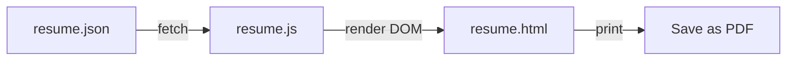

# Resume from JSON + PDF export

## Current setup

- Static site: [index.html](index.html), [styles.css](styles.css), [script.js](script.js). Deployed to GitHub Pages (root path). Dark theme, Inter font, accent `#39d353`.
- Resume links currently point to `https://gitconnected.com/joepegler/resume`. We will add an on-site resume page and keep or update those links.

## 1. Store editable resume JSON

- **Add** `resume.json` in the project root.
- Use the [gitconnected API schema](https://gitconnected.com/api/v1/resume/joepegler): `basics` (name, label, image, email, url, summary, profiles), `work[]` (company, position, start/end, highlights), `education[]`, `skills[]`, `awards[]`. You can seed this file by saving the response from that API once, or paste from the API and then edit locally; the page will only read from the local file.
- No build step: the file is served as a static asset and fetched at runtime from the resume page.

## 2. Resume page (HTML + render logic)

- **Add** `resume.html` as a standalone page that:
  - Reuses the same header/nav and footer as the main site (copy or minimal shared structure) so “Resume” appears in the nav and the look matches.
  - Fetches `resume.json` (e.g. `fetch('resume.json')`), then renders it into a single scrollable layout:
    - **Header**: name, label, optional image, summary, and contact (email, website, profiles as links).
    - **Skills**: list or tags from `skills[].name` (and optionally `level`).
    - **Experience**: for each `work[]` item — company name (link if `url`), position, date range, summary, and `highlights` as a list.
    - **Education**: institution, study type, area, dates, score/gpa.
    - **Awards**: title, awarder, date.
  - Uses a **“Print / Save as PDF”** button that calls `window.print()`. The browser’s “Save as PDF” (or “Print to PDF”) option gives you the PDF without adding a library.
- **Optional**: a small `resume.js` (or inline script in `resume.html`) that does the fetch + DOM building so the HTML stays minimal (e.g. a single `<main id="resume-root">` and a script that fills it).

## 3. Styling and print-friendly PDF

- **Resume styles** in [styles.css](styles.css) (or a dedicated `resume.css` linked only from `resume.html`):
  - Sections and typography that match the site (same font, accent color, spacing).
  - Clear hierarchy: name/title, section headings, job titles, bullet lists for highlights.
- **Print styles** (e.g. `@media print`):
  - Hide nav, footer, “Print / Save as PDF” button, and any decorative background (e.g. `.bg-dots`, `.bg-glow`) so the PDF is clean.
  - Use white/off-white background and dark text for readability when printed, or keep a simple dark theme if you prefer.
  - Ensure no unnecessary page breaks inside roles or highlights (e.g. `break-inside: avoid` on job blocks).

## 4. Navigation and links

- In [index.html](index.html): add a “Resume” item to the main nav linking to `resume.html`, and optionally change the contact “View technical resume” / “Resume” links from gitconnected to `resume.html` (or leave one link to gitconnected if you want both).
- In `resume.html`: nav should include “Home” (or “Back”) to `index.html` and “Resume” as current page.

## 5. PDF export (summary)

- **Primary**: “Print / Save as PDF” button → `window.print()` → user chooses “Save as PDF” in the dialog. No extra dependencies, works everywhere.
- **Optional later**: one-click “Download PDF” using a library (e.g. html2pdf.js or jsPDF + html2canvas) if you want a file download without opening the print dialog; this can be added in a follow-up.

## File changes summary

| Action | File                                                                                       |
| ------ | ------------------------------------------------------------------------------------------ |
| Add    | `resume.json` — single source of truth, editable by you                                    |
| Add    | `resume.html` — page that fetches JSON and renders resume + Print button                   |
| Add    | `resume.js` (optional) — fetch + render logic, or inline in `resume.html`                  |
| Edit   | `styles.css` — resume section styles + `@media print` for PDF                              |
| Edit   | `index.html` — add “Resume” to nav; optionally point contact resume links to `resume.html` |

## Data flow

## Schema support (resume.json)

Support the same shape as the gitconnected API so you can paste from `https://gitconnected.com/api/v1/resume/joepegler` and then edit:

- `basics`: name, label, image, email, url, summary, website, profiles[]
- `work[]`: company/name, position, url, startDate, endDate, summary, highlights[]
- `education[]`: institution, studyType, area, startDate, endDate, score/gpa
- `skills[]`: name, level (optional)
- `awards[]`: title, awarder, date

Optional fields (e.g. `meta`, `volunteer`) can be ignored by the renderer until you want to show them.
