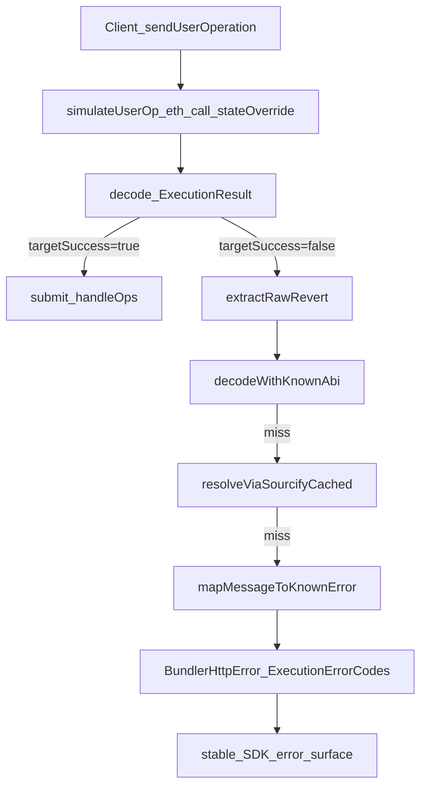

# From simulateHandleOp Revert Bytes to Stable SDK Execution Codes

[AA-173 / PR #321](https://github.com/eth-infinitism/account-abstraction/pull/321)  
[IEntryPointSimulations.sol](https://raw.githubusercontent.com/eth-infinitism/account-abstraction/develop/contracts/interfaces/IEntryPointSimulations.sol)  
[entrypointsimulations.test.ts](https://raw.githubusercontent.com/eth-infinitism/account-abstraction/develop/test/entrypointsimulations.test.ts)

## Opening

A UserOperation fails in simulation.

The wallet UI says "transaction failed."  
The bundler logs contain a revert payload, nested inside provider error wrappers, with just enough information to diagnose the root cause if someone manually parses it.

That gap is where many ERC-4337 systems lose reliability.

Not at quote time.  
Not at `eth_sendUserOperation` call time.  
At failure translation time.

In production, a bundler is not a thin relay. It is a policy engine that has to answer three questions, consistently:

- What failed?
- Is retry safe?
- What stable error code should the SDK get?

This deep dive focuses on that exact boundary: **revert decoding -> typed execution errors -> retry/quarantine behavior**.

## Local architecture snapshot

In this backend, `BundlerService.eth_sendUserOperation` does more than submit `handleOps`:

- acquires a bundler wallet from a pooled/quarantinable resource set
- verifies sponsorship
- estimates gas
- simulates the UserOp
- submits `handleOps` with retry and nonce mitigation

Simulation is performed with `eth_call` + `stateOverride` against EntryPoint, injecting `ENTRYPOINT_V7_SIMULATIONS_BYTECODE`, then decoding `simulateHandleOp` return data.

Core simulation branch:

```ts
const decodedResult = decodeFunctionResult({
  abi: ENTRYPOINT_V7_SIMULATIONS_ABI,
  functionName: 'simulateHandleOp',
  data: simulateHandleOpResult.data as Hex,
});

if (!decodedResult.targetSuccess) {
  if (decodedResult.targetResult === '0x') {
    throw new SilentSimulationError();
  }
  throw new ContractFunctionRevertedError({
    abi: [...simulationErrors],
    functionName: 'simulateHandleOp',
    data: decodedResult.targetResult as Hex,
  });
}
```

The important part is not only failure detection. It is what happens next.

## Decode pipeline deep dive

A single decode strategy is fragile in real traffic. This implementation uses a staged pipeline.

### 1) Extract raw revert from nested provider errors

`extractRawRevert()` walks viem `BaseError` chains and captures:

- `raw` revert bytes if present
- selector
- provider summary
- traversal trail (`walkTrail`) for forensics

### 2) Decode against known ABI

`decodeWithKnownAbi()` attempts deterministic decoding against curated `simulationErrors` (e.g. `FailedOp`, `FailedOpWithRevert`, `ERC20InsufficientAllowance`, `ReturnAmountIsNotEnough`).

### 3) Sourcify 4byte fallback (cached)

If known ABI decode fails, `resolveViaSourcifyCached()` looks up selector signatures and caches result (`BUNDLER_SOURCIFY_DECODE`) to avoid repeated network-dependent misses.

### 4) String-pattern fallback

If ABI-level decoding is incomplete/unknown, message heuristics classify common failure classes:

- allowance (`transfer amount exceeds allowance`, permit expiry/signature variants)
- balance (`insufficient balance` variants)
- slippage (`min return not reached`, selector markers)
- AA-formatted messages (`AA20`, `AA23`, `AA25`, etc.)

### 5) Map to typed errors + execution codes

`mapDecodedToError()` converts decoded/fallback context into `BundlerHttpError` subclasses with stable `ExecutionErrorCodes`.

Example fallback branch:

```ts
if (!decoded) {
  const fallbackMapped = mapMessageToKnownError(options.fallbackMessage, debug, extra);
  if (fallbackMapped) return fallbackMapped;
  if (options.fallbackMessage) extra.reason = options.fallbackMessage;
  return new UnknownBundlerError(debug, undefined, ExecutionErrorCodes.UNKNOWN_SIMULATION_ERROR);
}
```

This is what keeps the external contract stable when decode confidence is not.

## Typed error surface as product contract

`BundlerHttpError` is the boundary object exposed to clients (HTTP 516 in this service).

It carries:

- `type` (internal bundler class)
- `code` (`ExecutionErrorCodes`, SDK-facing stability layer)
- `userMessage` (safe, opinionated message)
- `reason` (best available technical cause)
- `debug` (structured forensic payload)

Representative mappings:

- `ReturnAmountIsNotEnough` -> `SLIPPAGE_EXCEEDS_THRESHOLD`
- `ERC20InsufficientAllowance` -> `INSUFFICIENT_ALLOWANCE`
- `FailedOp` / `FailedOpWithRevert` / AA messages -> `AA_VALIDATION_ERROR`
- silent/decode-failure paths -> unknown simulation categories

This is not "better logs." It is an API contract.  
SDK behavior, UX copy, and retry behavior all depend on it.

## Retry, quarantine, and nonce mitigation (separate concern)

Simulation classification and submission recovery are related but distinct.

Submission failures (`handleOps`) are handled with explicit retry policy:

- message-matched retriable errors (`nonce too low/high`, timeout/network, underpriced)
- gas error refresh path
- balance-related send failures that trigger wallet quarantine + recursive resubmission
- depth and retry limits (`MAX_RETRIES`, `MAX_RECURSION`)
- request timeout guard (`RequestTimeoutError`)

Nonce handling includes parsing node-provided hints:

```ts
private parseNextNonceFromWriteErrorMessage(writeErrorMessage: string): number | undefined {
  const match = writeErrorMessage.match(/next nonce\s+(\d+)/i);
  if (!match) return undefined;
  const parsed = Number(match[1]);
  return Number.isFinite(parsed) ? parsed : undefined;
}
```

And using hint-aware planning rather than blind increment:

```ts
if (retryError === 'nonce too low') {
  const candidate =
    nextNonceFromError !== undefined
      ? Math.max(nextNonceFromError, lastAttempted + 1)
      : lastAttempted + 1;
  hint = candidate;
}
```

That behavior is directly tested in `bundler.test.ts`.

## Spec vs Reality: EntryPoint simulation interface and production decode pipeline

Upstream semantics are clear in `IEntryPointSimulations`:

- `simulateValidation(...)`
- `simulateHandleOp(...)`
- `ExecutionResult` with `targetSuccess` and `targetResult`

PR #321 (AA-173) matters because it formalized simulation/view separation from execution EntryPoint concerns, including explicit discussion of simulation behavior and gas-parity safety concerns between simulation and execution pathways.

### What upstream gives you

- canonical interface semantics
- structured simulation result shape
- AA failure class expectations demonstrated in upstream tests (AA20, AA23, AA25, AA3x behavior)

### What production still has to solve locally

- nested provider error extraction
- decode miss handling under imperfect ABI coverage
- signature lookup caching/fallback behavior
- stable SDK error taxonomies
- retry/quarantine resource management
- replay-grade observability and confidentiality boundaries

A common overclaim is "spec-compliant simulation" meaning "production-safe error reporting."  
Spec alignment is necessary. It is not sufficient for production error reporting quality.

## Testing strategy: local + upstream evidence

This system's confidence comes from two layers:

### Local bundler tests

- `bundler-simulation.test.ts`: deterministic mapping tests for slippage/allowance/balance/AA-pattern paths, fallback behavior, Sourcify decode behavior.
- `bundler.test.ts`: lock/quarantine behavior and nonce mitigation regression tests.

### Upstream simulation tests

- `entrypointsimulations.test.ts`: canonical AA simulation semantics and expected failure classes (`AA20`, `AA23`, `AA25`, AA3x variants), including validation/simulation intent in reference implementation.

Use both: upstream for protocol semantics, local for product behavior.

## What most teams get wrong

- treating decode as one stage instead of a fallback chain
- collapsing simulation failures and `handleOps` send failures into one "unknown"
- retrying nonce errors without parsing node-provided next nonce hints
- not releasing/quarantining bundler wallets correctly during recursive retries
- returning provider messages directly to clients instead of typed stable codes
- claiming full spec parity while relying on local heuristics/custom bytecode
- keeping only `userOpHash` and missing replay-critical context like block number and packed user op

## Failure-path flow



## Closing

The hardest part of ERC-4337 backend work is not calling EntryPoint correctly.  
It is making failures legible, classifiable, retry-safe, and consistent for downstream clients.

When a bundler can explain *why* an op failed, decide *if* it should retry, and emit a stable execution code with replay context, it stops being a transport shim and becomes real infrastructure.

That is where reliability starts.